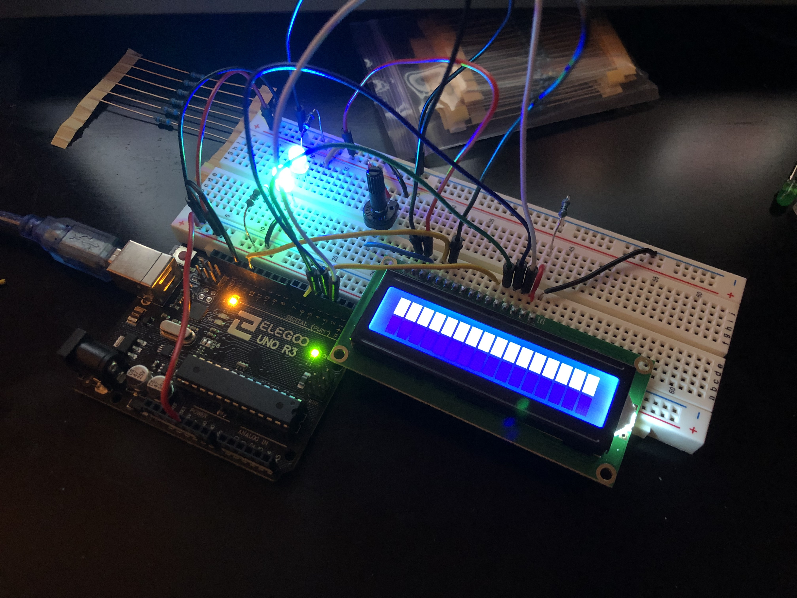

# Debbie the Decibel Robot

https://github.com/bananabrann/debbie

### Contents

1. About
1. Technologies
1. The Process
1. Medals
1. What's Next?

# About

Debbie is a simple robot who captures its surrounding area, analyzes it, calculates for Decibel, and displays it all on-board and separate from a host computer.

Click for Picture!

# Technologies

The mission is build a simple robot that measures the surrounding sounds and displays a decibel level.

-  Has an Elegoo R3 as the microprocessor.
-  Be typed in C++.
-  Does not have any motors or moving parts/peripherals.

# The Process and Its Planning
From baby breadboard to super intelligent AI, Decibel Debbie's path has been a huge learning experience for me. As a junior developer, tackling something like Decibel Debbie was daunting enough, yet alone tackling the software language of C++ for the microprocessor.
In the end, building something is very rewarding, and seeing physical actions from your code is something worth a hobby, if not a career.

## Learning Basic Electronics

The first thing to learn when starting a project you've never done before, is to learn the basics. In the first weeks of March, I sketched out, researched, and watched as many YouTube videos as I could on the basics of electricity, breadboards, and simple LED lights.

Click for Picture!

As you can see, the circuitry is very simple. This process was maybe about a day long. The red wire is 3.3V (constant) and successfully transfers its electricity through a resistor, to the LED, and back to the microprocessor in Ground.

## Chaining Things Together

What's after one successful ligh? Two successful lights! Using the knowledge from before, adding a second light following the same scheme as before proved to be quite simple.

Click for Picture!

## Controlling the Flow (Physically)

Time to play with electricity! To follow start to grasp what's happening in the breadboard, I planned out what it would look like to have things like a button control a constant flow of electricity to a light.

Click for Picture!

s
A viola! I now understand how the electricity flows in the breadboard, and can start planning for more advanced circuits! 

## Connecting The Screen

Several guides were needed to figure out how to connect the screen to the microprocessor. The plan for this was to simply display fixed messages in the code to ensure the screen would work.
Once the screen displayed fixed messages, the idea was that the microphone would send data to the microprocessor, and then the microprocessor would simply just redirect that data to the `lcd.print()` function.

Click for Pictures!

It was a bit of document reading and experimentally plugging things in for two days before this picture captured the very first time something displayed on the LCD screen.
You can see it on the screen because of the brightness, but the data is actually being received by the LCD properly. `lcd.print("hello!");` was in the code, and successfully getting to the LCD.

## Mic Drop

Click for Picture!

In the code, I planned for and made sure to write clean, simple code. The code would check the microphone's pins every third of a second. The microprocessor checks its gate value. If it's TRUE (1), meaning a spike is detected, a function executes that reads the pin containing the microphone's envelope value. That value is received, and a function calls the a calculation function that returns the predicted Decibels of the sound. Then that number is passed to the LCD screen, where it then formats and prints the value.

Reading documentation of the microphone was a process, but in the end data (whatever it is) was eventually displayed. Debugging this would take the next two to three days, and would lead to the discovery that how wires are plugged in matters.
It was a bad wire problem. The envelope wire was damaged resulting in crazy, uninterpretable sentences ,and simply needed to be replaced.

## It's Alive!
After debugging the microphone data wire issue, cleaning and cutting the wires for a higher efficiency, and formatting the printing screen to how I wanted it, Debbie finally met the Bronze Medal on March 11th, 2019!

Click for Picture!

_____

# Medals

<!-- 

Click Me!
 -->

### 🥉Bronze Medal, MVP

(Minimum Viable Product) For the minimum requirement, the robot will...

-  [x] be named Decibel Debbie.
-  [x] be completely self-sustaining --not hooked to a computer.
-  [x] use an external microphone to detect sound, then ↓...
-  [x] successfully display the decibels on a 7-segment LED display.

### 🥈Silver Medal

After reaching MVP, it would be nice if Debbie ...

-  [x] have an additional display that displays the text of sounds of a similar decibel level that is currently being picked up. E.g., displayed "vacuum cleaner" when the decibel level is between 75 to 85 dB.

### 🥇Gold Medal

For final state of Debbie, Debbie will...

-  [ ] will have a protective external shell to guard her inner bits.
-  [ ] will have clean, color-coded wires along with a permanent, soldered base.

<!-- 
 -->

# What's Next?

Decibel Debbie is meant for a one-shot project. Currently, there are no more hardware implementations for Decibel Debbie. Code will be continued to be refactored and made more efficient, including any software additions that add user interface ease.
